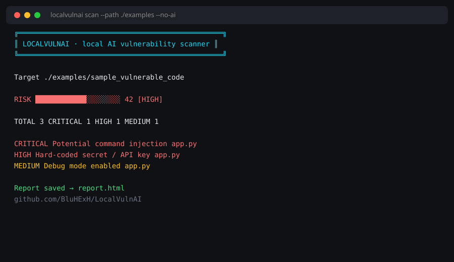
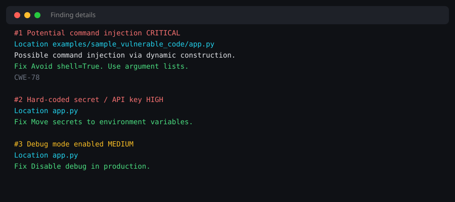

# LocalVulnAI

<p align="center">
  <strong>Local AI-powered vulnerability scanner</strong><br/>
  Patterns + optional Ollama · Web checks · Beautiful CLI · CI-ready
</p>

<p align="center">
  <a href="https://github.com/BluHExH/LocalVulnAI"></a>
  <a href="https://github.com/BluHExH/LocalVulnAI/blob/main/LICENSE"></a>
  
  
  
</p>

> ⚠️ **Authorized testing only.** Only scan code and systems you own or have permission to test.

---

## Preview

<p align="center">
  
</p>

<p align="center">
  
</p>

---

## Why LocalVulnAI?

| | |
|---|---|
| **Local-first** | Code never leaves your machine (optional Ollama) |
| **Useful CLI** | Color score, severity cards, clear fixes |
| **Real checks** | Secrets, SQLi, RCE patterns, headers, cookies, deep web |
| **Reports** | Markdown · JSON · SARIF · Burp-friendly · HTML |
| **Workflow** | Git-diff scan · baseline ignore · pre-commit · Actions |

---

## Quick start

```bash
git clone https://github.com/BluHExH/LocalVulnAI.git
cd LocalVulnAI
python -m venv .venv && source .venv/bin/activate
pip install -r requirements.txt

python -m localvulnai scan --path ./examples/sample_vulnerable_code --no-ai
python -m localvulnai scan --path ./examples/sample_vulnerable_code --no-ai -o report.html -f html
```

**One-click cloud shell:** [Open in Codespaces](https://codespaces.new/BluHExH/LocalVulnAI)

---

## Commands

```bash
# Code
python -m localvulnai scan --path ./src --no-ai
python -m localvulnai scan --path ./a,./b --no-ai
python -m localvulnai scan --git-diff --no-ai

# Web
python -m localvulnai scan --url https://example.com
python -m localvulnai scan --url https://example.com --deep

# Reports
python -m localvulnai scan --path . --no-ai -o out.sarif -f sarif
python -m localvulnai scan --path . --no-ai -o out.html -f html --lang bn

# Baseline (hide known noise)
python -m localvulnai baseline --path .
python -m localvulnai scan --path . --no-ai --ignore .localvulnai-ignore

# Web UI
uvicorn localvulnai.web.app:app --port 8000
```

---

## Features

- **Code:** secrets (AWS/GitHub/Slack/Stripe…), SQLi, command injection, eval, XSS, deserialization, weak hash, debug mode, path traversal, open redirect, SSRF hints
- **Custom rules:** `rules.yml` (see `rules.example.yml`)
- **Web:** CSP/HSTS/cookies + Playwright `--deep`
- **Integrations:** webhook, pre-commit, scheduled GitHub Actions, Docker, SARIF upload

---

## Install extras (optional)

```bash
ollama pull llama3.2          # AI explanations
playwright install chromium  # --deep web scans
```

---

## License

MIT · Built for learning and authorized security testing.
